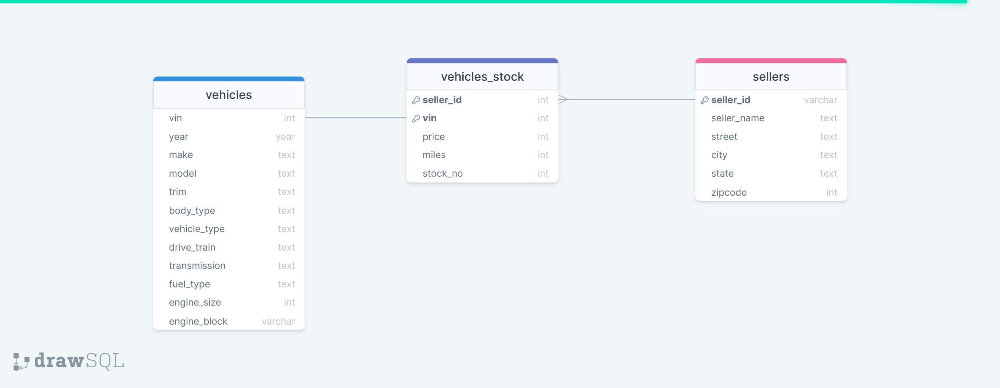

# ltv-test

This project consist of a series of scenarios to simulate a DAG's pipeline development from Airflow, in which we perform a series of steps, from an ingestion, transform and a possible load.

## Installation

This project use a docker container deployment so we asume you have a docker desktop instance on your computer.

Once you clone the repo from this link, you can open a terminal in the cloning path and execute the following command to install the container requirements

```
mkdir -p ./dags ./logs ./plugins 
echo -e "AIRFLOW_UID=$(id -u)" > .env
```

Once that is done you execute the next command:
```
docker-compose up airflow-init
```

Now you are ready to initialize the services with the following command:

`docker compose up`

Once that command is running you can enter the UI of Airflow going into this link on your browser:

[Airflow](http://localhost:8080/home)

In there look for the following dag:

**ltv-pipeline**

or using the following tag:  **ltv**

Once you access the Dag you just need to execute the dag and it would 


## RDBMS DIAGRAM
The following is a diagram for a mysql schema, based on the data provided:




## Extra Credits

For the extra credits instead of having to ingest a table that contains the information, I decide to look for a vin decode api that returns a json with the vin information, which I parsed to map the vin into the desire option, I limit this part to a 1000 records, so the output would be ready faster. The logic for the mapping is inside the dag functions.

### Author
Author of the dag:

 **Luis Felipe Cubero Vargas**